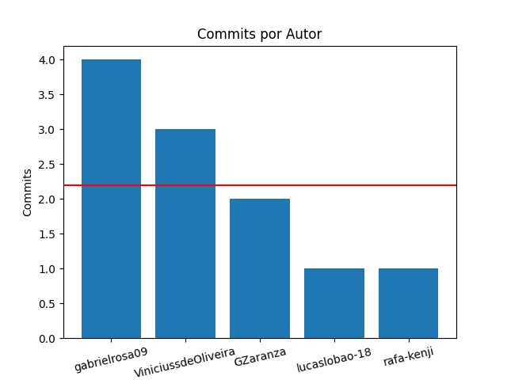

## Relatório do dia: 06-18-2023 até 06-22-2023

### Pessoas que fizeram commits:

- lucaslobao-18

- rafa-kenji

- GZaranza

- ViniciussdeOliveira

- gabrielrosa09

# Lista dos commits:

## Usuário: lucaslobao-18
### Títulos do commits:
- Cria a funcao relatorio geral com a main atualizada

## Usuário: rafa-kenji
### Títulos do commits:
- Merge pull request #58 from fga-eps-mds/refatoracao_biblioteca

## Usuário: GZaranza
### Títulos do commits:
- add a def tittle_commits na gitInfo.py
- Merge pull request #57 from fga-eps-mds/issue_39

## Usuário: ViniciussdeOliveira
### Títulos do commits:
- Atualizando a branch refatoracao_biblioteca
- Juntando as funções commit_palavra() e check_extension() que estavam em arquivos separados no gitInfo.py
- Juntando as funções calculate_commit_average() e commit_data(), que estvão em arquivos separados para a gitInfo.py

## Usuário: gabrielrosa09
### Títulos do commits:
- removendo arquivo arquivo_title.md
- finalizando a funcao de listar commits por autor
- Merge branch 'issue_39' of https://github.com/fga-eps-mds/2023.1-RelatorioGitPython into issue_39
- Merge branch 'main' of https://github.com/fga-eps-mds/2023.1-RelatorioGitPython into issue_39

# Lista de Commits com Coautor:

| Hash | Autor | Coautor |
|------|-------|---------|
|814b61|lucaslobao-18|['Catlen Oliveira ']|
|84f7e2|GZaranza|['Vinicius de Oliveira ']|
|d105ff|Gabriel da Silva Rosa|['Catlen Oliveira ', 'lucaslobao-18 ']|
|e41bae|Vinicius de Oliveira Santos|['Gabriel Zaranza ']|
|8c3f5d|Vinicius de Oliveira Santos|['Gabriel Zaranza ']|

# Commits por pessoa e Média Geral

| Autor | Commits | Média |
|-------|---------|-------|
|gabrielrosa09|4|2.2|
|ViniciussdeOliveira|3|2.2|
|GZaranza|2|2.2|
|lucaslobao-18|1|2.2|
|rafa-kenji|1|2.2|

